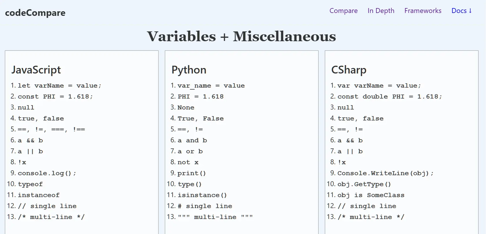

# codeCompare – Programming Language Syntax Comparison Tool

> NOTE: I need to redo this README but I added `prism.js` and `prism.css` to `.gitignore` because they are not my code, they are large, and anyone wanting to clone this repo may want a different Prism theme.
> I also need to add a TypeScript option

CodeCompare is a programming language syntax comparison tool that helps developers learn new languages faster by viewing code side-by-side with technologies they already know.

The project focuses on visual pattern recognition, showing how common programming concepts — such as functions, loops, conditionals, and data types — are written across different languages and frameworks.

Built with HTML, CSS, JavaScript, and Prism.js, it provides a quick reference for comparing syntax between ecosystems.

<div align="center"></div>

## Project Overview

**Code Comparison** is designed to help learners bridge knowledge between technologies. Instead of learning in isolation, users compare syntax, structure, tooling, and architectural patterns across:

- Programming languages
- Frontend frameworks
- Full-stack frameworks

The project emphasizes **mental model translation** — helping developers recognize how the same concepts appear in different environments.

> **Note (as of 3/17/2026)**  
> The layout and core comparison structure are in place. Syntax sections are dynamically generated on `index.html`, as are the code blocks on `details.html`.
>
> Full implementation examples on the `frameworks.html` page are still in progress. The current version focuses on UI structure, styling, and core comparison behavior, with expanded examples planned.

---

## Features

### Home page

1. User selects their primary language and a secondary language(s) to compare to their primary then submit the form
2. List items are displayed for a row by row comparison
   - Variables + Miscellaneous: showing things in common like syntax to define a variable or to log/print output.
   - Sections for different data type that shows methods/functions in common
3. Pre block comparisons
   - Syntax comparison for loops, conditions, function, declaration, etc.

### Details page

1. User selects their primary language and 1 secondary language
2. User can then select a specific data type
3. USer can view all methods for that data type or choose a specific method/function
4. After submitting the form, pre block comparison are shown to view the code for each language for various methods for that data type.

### Frameworks page

This page is under construction but will allow the user to compare 2 web frameworks.

## Demo / Live Site

Try the project here: https://compare-code.netlify.app/

---

## Technologies Used

- HTML5
- CSS3 (Flexbox & Grid layouts)
- JavaScript (DOM manipulation & dynamic content generation)
- [Prism.js](https://prismjs.com/) for syntax highlighting
- Semantic `<code>` and `<pre>` elements for structured code display
- `localStorage` to retain user selections between pages

---

## Installation

```sh
# Clone this repo
git clone https://github.com/Kernix13/codeCompare.git

# Change into project directory
cd codeCompare
```

## Usage

1. Open `index.html` with the VS Code extension **_Live Server_** which opens on port `5500`
2. You can now interact with the project UI byt choosing the form elements that best fits your needs.
   - Review side-by-side code to understand structural and conceptual differences
3. To change the languages and code for each page & section, edit the files in `js/data`
   - `indexListEls.js`: the list items for `index.js`
   - `indexPreEls.js`: the pre elements for `index.js`
   - `detailsPreEls.js`: the pre elements for `details.js`
   - `frameworksPreEls.js`: the pre elements for `frameworks.js`

---

## Project Structure

```sh
/
├── README.md
├── LICENSE
├── CODE_OF_CONDUCT.md
├── CONTRIBUTING.md
├── .gitignore
├── .github/                   # GitHub workflows, issue templates
├── details.html
├── frameworks.html
├── index.html
├── css/
├── docs/                      # Developer notes in Markdown
├── js/
│   ├── details.js             # Main file for details.html
│   ├── frameworks.js          # Main file for frameworks.html
│   ├── global.js              # File for globally used JavaScript
│   ├── index.js               # Main file for index.html
│   ├── prism.js               # File downloaded from for Prism.js
│   ├── data/
│   │   ├── detailsPreEls.js   # Main file for details.js
│   │   ├── frameworkEls.js    # Main file for frameworks.js
│   │   ├── indexListEls.js    # Main file for index.js
│   │   └──indexPreEls.js      # Main file for index.js
```

## Future Improvements / To-Do

1. **IMPORTANT**: The length of the array for each data type has to be the same in each language object or the app breaks. I need to fix that.
2. I need to change the data types to match primary language, e.g. "Array" to "List" for Python.
3. The docs drop-down menu is causing horizontal scrolling - either shrink the entire menu font size (it looks too big anyway) or position the drop-down differently
4. This project needs a database and a form to enter all t he code which means I need a server -> live deploy with a basck-end

### Future Direction

The `/docs` section is designed to expand into a customizable notes system where:

- Each language or framework can have its own Markdown file
- Notes can include:
  - Code snippets
  - Links to official docs
  - Key concepts
  - Gotchas and reminders
- The navigation may evolve into a dropdown list of available note files
- Users could add their own `.md` files to personalize the learning experience

This makes the project not just a comparison tool, but also a structured learning workspace.

---

## NOTE: For Developers

The languages and frameworks in the forms on all 3 pages are specific to myself, and even they will change over time. If you want to use this project for yourself, then you will most likely want to customize the language choices.

Right now, this project uses HTML + CSS + JavaScript but that may change in the future. If you develope using different languages, then you may not know what you need to change. Here are code blocks you will need to change:

```js
// Coming soon
```

---

## Contributing

Contributions are welcome. Please review [CONTRIBUTING.md](./CONTRIBUTING.md) for guidelines, workflow, and code style expectations.

---

## License

Licensed under the [MIT License](./LICENSE). Free to use for educational purposes.
